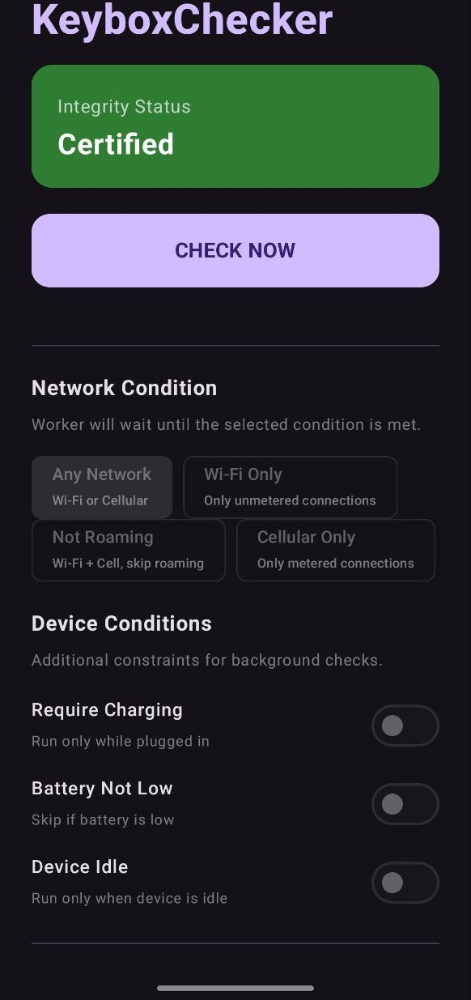
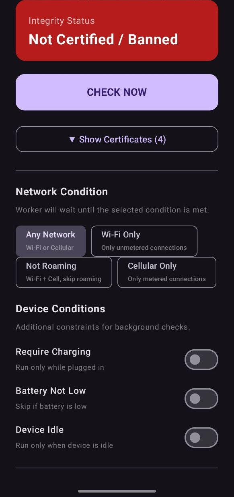
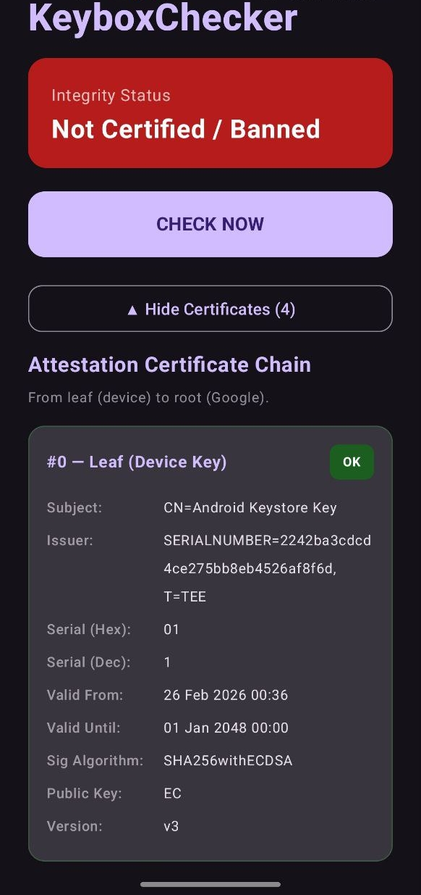
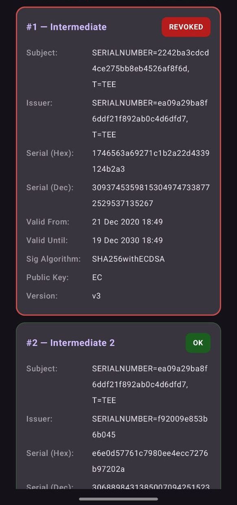
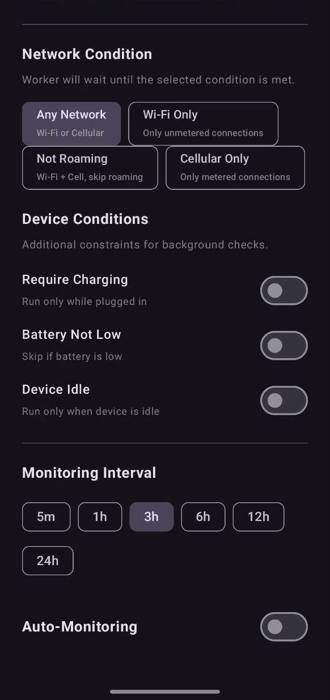

# KeyboxChecker

**KeyboxChecker** is an open-source Android application designed to continuously monitor and verify the integrity of your device's Hardware Keystore (Keybox). It checks whether your device's hardware-backed attestation keys have been revoked or banned by Google.

This tool is especially useful for custom ROM users, developers, and security enthusiasts who want to ensure their device passes hardware attestation (Play Integrity / SafetyNet) and that their Keybox remains fully certified.

## 🌟 Key Features

* **Real-time Attestation Checking:** Generates a fresh hardware-backed key pair (using StrongBox when available, falling back to TEE) and validates its certificate chain against Google's official Certificate Revocation List (CRL).
* **Background Monitoring (Sentinel Service):** Runs silently in the background using `WorkManager` to periodically check your Keybox status without user intervention.
* **Smart CRL Caching:** Uses ETag and a 5-minute local cache to dramatically reduce battery consumption and network data usage. It only downloads the revocation list if it has changed or the cache is stale.
* **Customizable Constraints:** Configure the background worker to only run under specific device conditions to save battery:
  * Network Type (Any, Wi-Fi Only, Cellular Only, Not Roaming)
  * Device Charging State
  * Device Idle State
  * Battery Not Low State
* **Adjustable Intervals:** Choose how often the background service checks your status (from every 5 minutes up to 24 hours).
* **Instant Alerts:** Triggers a high-priority system notification 🚨 if your Keybox is detected as "Banned" or "Revoked".
* **Detailed Certificate Inspector:** View the full X.509 attestation certificate chain directly within the app, including subject, issuer, serial numbers, and validity dates.
* **Clean & Modern UI:** Built entirely with Jetpack Compose featuring a responsive Dark Mode layout.
* **Multi-Language Support (i18n):** Fully localized interface supporting **English, Russian, Spanish, and Chinese**.

## 📸 Screenshots

| Certified ✅ | Banned ❌ | Banned + Check |
|:---:|:---:|:---:|
|  |  |  |

| Certificate Chain | Settings |
|:---:|:---:|
|  |  |

## 🚀 Installation & Build

### Pre-requisites

* Android Studio (Ladybug or newer recommended)
* JDK 17
* Android Device with SDK 24+ (Android 7.0 Nougat or higher)

### Build Locally (Debug)

Clone the repository and build via Android Studio, or run in terminal:

```bash
git clone https://github.com/KukushIvan/KeyboxChecker.git
cd KeyboxChecker
./gradlew assembleDebug
```

### Build Releases (Securely)

This project uses a secure mechanism extending `local.properties` (or `keystore.properties`) and Environment Variables to prevent leaking keystore credentials.
If you fork this repo and want to build a signed release APK via GitHub Actions:

1. Go to your GitHub Repository **Settings** -> **Secrets and variables** -> **Actions**.
2. Add the following Repository Secrets:
   * `KEYSTORE_PASSWORD` — Your keystore password.
   * `KEY_ALIAS` — Your key alias name.
   * `KEY_PASSWORD` — Your key alias password.
   * `RELEASE_KEY` — Your `.keystore` or `.jks` file encoded in Base64 (`certutil -encode my-release-key.keystore release_key.txt`).
3. Go to the **Actions** tab, select **Android Release Build**, and click **Run workflow**.
4. The compiled and signed `app-release.apk` will automatically appear in the Workflow run's artifacts and/or GitHub Releases.

## 🛠 Tech Stack

* **Kotlin**
* **Jetpack Compose** (Material 3)
* **WorkManager** (For robust background scheduling)
* **OkHttp3** (For efficient network calls with ETag caching)
* **Android KeyStore & KeyPairGenerator** (For cryptographic hardware operations)

## 📄 License

This project is open-sourced software licensed under the [MIT license](LICENSE).
